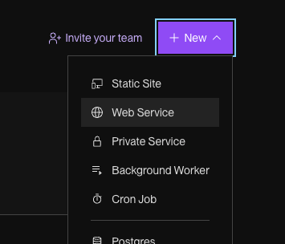
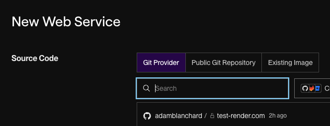
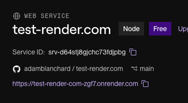

# Deployment Quick Start Guide

Deploying your apps to the web is a really satisfying part of development! There are many possibilities, and depending on the complexity of your app, it can get complicated.

This guide is to get you started with deploying a basic app, and a starting point to configuring more complex deployments yourself.

## Starting requirements

This guide assumes you have a full stack app in one repo, for example:
1. Your html files in e.g. `/public`
2. An executable server e.g. `server.js`
3. An optional sqlite database

## Steps

There are many tools that offer free deployment options. The one we use at HYF is [render.com](https://render.com).

1. Create an account on [render.com](https://render.com) if you don't have one already. 
2. Find the option to create a new web service.

   
   
4. Connect to the GitHub repository you wish to deploy.

   
   
6. Most of the default settings should be fine, but make sure your it all looks correct. **It's important to select the Free plan**. The `Start Command` should also likely match the same command you use to start your server locally.

   
   
8. Click Deploy and wait for the build to finish. You will find the public url at the top of your service.

   
   
10. Everything should now be deployed!

## Tips

- Note that on the Free plan, if your service has inactivity for 15 minutes, it will shut down. If you try to access it again, it will need to restart, which can take up to a minute. 
- If you're using an sqlite database in this setup, be aware that it will reset every time you redploy, so it is not suitable if you wish to persist new data across redeployments.

Using PostgreSQL? Or looking for a more in depth, advanced guide? Check out [HYF Project Template - Deployment Instructions](https://github.com/HackYourFuture-CPH/hyf-project-template?tab=readme-ov-file#deploying).
